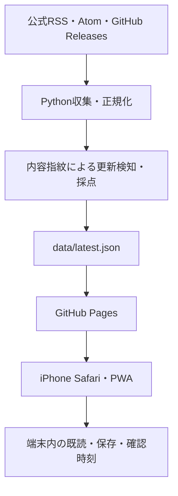

# News-auto-correct · My Radar

**前回確認から、自分に関係する何が変わったか。** iPhoneで10〜30秒で状況を把握する個人用情報レーダーです。

[My Radarを開く](https://kanzennirikaisita.github.io/News-auto-correct/) · [収集Actions](https://github.com/kanzennirikaisita/News-auto-correct/actions/workflows/collect.yml)

> 初回は下記のPages設定とmainへのマージが必要です。公開前は上のリンクが404になります。

## 画面と機能

画面上部に「前回確認」「重要な変化の件数」「Work / AI / Dev / Game / Gadgetの増分」を表示。その下に重要度の高い変化を最大3件、新着・更新一覧を続けます。PCは左ナビ、iPhoneは下部ナビです。外観はライト・ダーク・端末追従から選べます。

- 重要度60以上を「重要」、80以上を「🔥 優先」として表示
- 全件 / 前回確認以降 / 重要 / 保存 / カテゴリ / 未読 / タイトル・情報源・タグの検索
- 記事の更新を検知するとUPDATE表示。既読の記事も更新後は未読に戻る
- 「確認済みにする」で今回取得済みの記事を一括確認。単に開いて閉じても増分を消さない
- 記事ごとの保存・既読切替・非表示。非表示の管理から再表示可能
- 保存した記事のタイトル・リンクは、公開データの保持期間が過ぎても端末に残る
- 最終収集日時、24時間以上の経過表示、各情報源の最終成功日時
- ホーム画面追加・オフライン時の直前データ表示

## アーキテクチャ



フロントはVanilla JS / CSS、収集はPython標準ライブラリのみ。ビルド・APIキー・外部DB・常時稼働PCは不要です。GitHub Actionsの標準Linuxランナーと公開リポジトリのPagesを使います。課金サービスや追加Secretsは使いません。

## 初回公開

1. 実装PRをmainにマージします。
2. リポジトリの **Settings → Pages → Build and deployment → Source → GitHub Actions** を選択します。
3. **Actions → Collect radar feed → Run workflow → main** で初回収集します。マージ時にも対象ファイルの変更から収集が起動します。
4. **Deploy GitHub Pages** の成功を確認します。設定前に失敗していた場合は **Run workflow → main** で再実行します。
5. [公開ページ](https://kanzennirikaisita.github.io/News-auto-correct/)をSafariで開き、共有メニューの **ホーム画面に追加** を選びます。

`github-pages` Environmentの保護規則を設定している場合はmainからのデプロイを許可してください。組織やリポジトリでActionsが禁止されている場合は許可が必要です。収集commitが権限エラーになる場合はActionsの書込みを許可してください。`collect.yml` は必要な `contents: write` を明示しています。

PRでは公開用mainを変更しません。初期開発ブランチでは収集とテストだけを実行し、Pagesのデプロイはmainに限定します。

## ローカル開発（Windows対応）

Python 3.11以上を用意します。UIテストにはNode.js 22以上を使います。フロントの依存インストールはありません。

```sh
git clone https://github.com/kanzennirikaisita/News-auto-correct.git
cd News-auto-correct
python -m http.server 8000
```

ブラウザで `http://localhost:8000/` を開きます。Node.jsがあれば `npm run dev` でも起動できます（npm install不要）。開発サーバーの `/?preview=mobile` は390px幅の確認用です。Windowsでは環境に応じて `python` を `py` に置き換えます。`file://` ではfetch・Service Workerが動きません。HTTPSまたはlocalhostが必要です。

```sh
python collector/collect.py
python -m unittest discover -s tests -p "test_*.py" -v
node --test tests/domain.test.mjs tests/service-worker.test.mjs
```

GitHub Pagesのサブパスを再現する場合は、一つ上のフォルダでHTTPサーバーを起動し、`http://localhost:8000/News-auto-correct/` を開きます。

## 情報源と追加方法

`config/sources.json` に集約しています。初期13ソースです。

| カテゴリ | 情報源 | 方式 |
|---|---|---|
| Work | デジタル庁、JPCERT/CC、JVN、JPCERT/CC Eyes | RSS / Atom |
| AI / Dev | OpenAI、GitHub Changelog | RSS |
| AI / Dev | Dify、Codex、Claude Code | GitHub Releases API |
| Game | FFXIV Lodestone | 公式ニュースのリンク取得 |
| Game | ELDEN RING、Steam News | RSS |
| Gadget | Apple Newsroom日本語 | RSS |

```json
{
  "id": "my-oss",
  "name": "My OSS",
  "category": "ai-dev",
  "type": "github-releases",
  "url": "https://api.github.com/repos/OWNER/REPO/releases?per_page=30",
  "enabled": true,
  "official": true
}
```

`id` は一意にし、カテゴリは `work` / `ai-dev` / `game` / `gadget`。`type` は `rss`（Atom・RDFも対応）、`github-releases`、`html-links`。HTML方式には `linkPattern` 正規表現が必要です。可能ならRSSを使い、追加後は手動収集で件数とエラーを確認してください。公開情報・利用条件を確認した公式配信に限定します。

`enabled: false` にすると次回収集から公開一覧から除外されます。端末の保存済み記事は残ります。GitHubのdraft / prereleaseは初期設定では対象外です。

グラブル、ゼンレスゾーンゼロ、MOD、総務省、J-LIS、IPAなどは初期対象に含めていません。安定した取得方法を確認してから追加する方針です。GitHub APIは匿名の制限内で取得します。多数追加する場合はレート制限を確認してください。

## 更新検知・データ構造

中心ファイルは `data/latest.json`。`schemaVersion`、`generatedAt`、`collector`、`sources`、`items`を持ちます。公開・検知日時はUTCのISO 8601、画面は端末のタイムゾーンです。

| フィールド | 意味 |
|---|---|
| `id` | 追跡パラメータ・フラグメントを除いたURLのSHA-256先頭24文字 |
| `title`, `url` | タイトルと元サイト |
| `sourceId`, `sourceName`, `category` | 情報源と分類 |
| `publishedAt` | 情報源の公開日時。分からなければnull |
| `detectedAt` | 初回検知日時。再収集では変えない |
| `updatedAt` | 内容変化を最後に検知した日時 |
| `sourceUpdatedAt` | 情報源が配信する更新日時 |
| `changeType` | `new` / `updated`。未変更の再取得でnewへ戻さない |
| `revision`, `contentHash` | 更新世代と内容の指紋 |
| `importance`, `importanceReasons`, `tags` | 0〜100の重要度・判定理由・タグ |
| `summary`, `kind` | 要約はnull。種別はarticle / release |

RSSのタイトル・配信本文・配信更新時刻から指紋を作ります。記事本文の転載はせず、ハッシュだけを保持します。同じ正規化URLを複数ソースから取得した場合は設定順の最初のソースを優先します。意味的な同一ニュースの統合や、RSSに反映されないリンク先本文の変更は対象外です。

既存の記事が変われば同じIDのままrevisionを進め、既読状態を再判定します。初回に古い公開記事を大量投入せず、原則30日以内の公開・更新を採用します。最終変化検知から30日、最大3,000件を保持。各ソースは最大200件を処理、GitHub Releasesは通常直近30件、応答サイズが大きいCodexのみ直近10件です。取得上限を超える量の更新は取りこぼす可能性があります。

HTMLリンク方式はタイトル・リンクの変化だけを扱い、本文差分は扱いません。Lodestoneの日時用コードに含まれる数値を日付として抽出しますが、コードは実行しません。抽出できない公開日時はnullです。Atomに更新日時だけがある場合、画面では「配信更新」と表示します。

## 重要度

`config/scoring.json` を編集します。基礎点20 + 公式20 + 公開24時間以内10 + キーワード加点を0〜100へ制限。リリース種別は15点加算します。カテゴリ別ルールもあります。誤検知を減らすため、長い配信本文ではなくタイトルを採点します。新しさの加点は毎回再計算します。スコアはルール上の優先順位であり、実際の危険度判定ではありません。

## GitHub Actions

- `collect.yml`: JST **07:17 / 12:17 / 18:17 / 22:17**、手動、収集コード・設定の変更時。収集 → JSON比較 → commit / push。部分失敗でも継続し、前回の記事を保持。全ソース失敗時は失敗状態を保存してworkflowを失敗にします。
- `pages.yml`: mainのpush、手動、mainの収集workflow完了後に公開。**GITHUB_TOKENによるcommitではpushワークフローが起動しない**ため、`workflow_run` を使用します。常にmainから公開し、PRコードを特権実行しません。
- `test.yml`: push・PRでPython / JavaScriptのテストを実行。

同一ブランチの収集は直列化。dataだけのcommitは次の収集を誘発しません。ファイル差分ゼロならcommitしません。正常に巡回した事実を示す最終収集日時・ソース状態は更新するため、記事が増えなくても通常は1日4回の稼働記録commitが発生します。Git履歴を大量の本文保存として使わず、JSONサイズは制限します。

cronは厳密な時刻の保証ではなく、GitHub側で遅延・未実行となる場合があります。公開リポジトリの定期実行は長期間活動がないと無効化されることがあります。24時間経過表示とActions画面を確認してください。

## PWA・プライバシー

相対パスとService Workerのscopeで `/News-auto-correct/` 配信に対応。アプリ本体をキャッシュ優先、latest.jsonをネットワーク優先で取得し、通信失敗・8秒タイムアウト時は前回のJSONへ戻ります。初回Service Worker準備後にもデータをキャッシュします。オンライン復帰・画面への復帰・更新ボタンで再取得します。UI変更時は `sw.js` の `VERSION` を更新します。

`localStorage`に最終確認時刻、収集済みデータの確認位置、既読世代、お気に入りの最小記事情報、非表示、カテゴリ・未読・外観を保存。サーバーへ送信しません。アクセス解析・外部フォント・外部JSはありません。元記事を開くと、そのサイトには通常の通信が発生します。

公開リポジトリ・Pagesの情報源設定と収集データは誰でも閲覧できます。秘密情報・Cookie・APIキー・氏名・行政内部情報を追加しないでください。将来キーを使う場合はGitHub Actions Secretsとし、出力JSONやログに含めない設計が必要です。

SafariのWebサイトデータ削除、プライベートブラウズ、ストレージの自動削除で端末状態・キャッシュが消えることがあります。Safariとホーム画面PWAで状態が共有されるとは限りません。初回オンライン読込が完了する前にはオフラインで使えません。保存記事は全文のオフライン保存ではありません。

## 検証と制約

2026-09-09の開発ブランチで、GitHub Actionsの実収集 **13 / 13ソース成功、218件** を確認。自動テストはPython 8件 + JavaScript 7件が成功しました。Chromeでカテゴリ・検索・既読・保存・再読込後の保持・確認済み操作を確認し、390px枠（描画領域375px）で横にはみ出さないことを確認しました。詳細は [検証記録](VALIDATION.md)。

自動テストでRSS / Atom / RDF、GitHub Releases、HTMLリンク、更新・保持・重複・部分失敗、確認位置、未読復帰、保存の保持、フィルタ、Service Workerのサブパス・オフライン・キャッシュ分離を確認します。

iPhone実機でのインストールは実機確認が必要です。safe-area、viewport-fit、44px以上の操作領域、16pxの検索入力、下部ナビ、standalone、Apple用アイコン、キーボードフォーカス、色以外のNEW / UPDATE / 重要表記を実装しています。ソースによって配信停止やHTTP 403、レート制限が起こる可能性があります。取得成功はリンク先本文すべての監視成功を意味しません。

## 今後の候補

HTML本文差分、公式情報源追加、イベント日付抽出・近日ビュー、OPML、監視キーワードUI、情報源ON/OFF、更新タイムライン、ローカルLLM要約、保存データのエクスポート。アカウント・DB・有料API・プッシュ通知はMVPに含めません。
